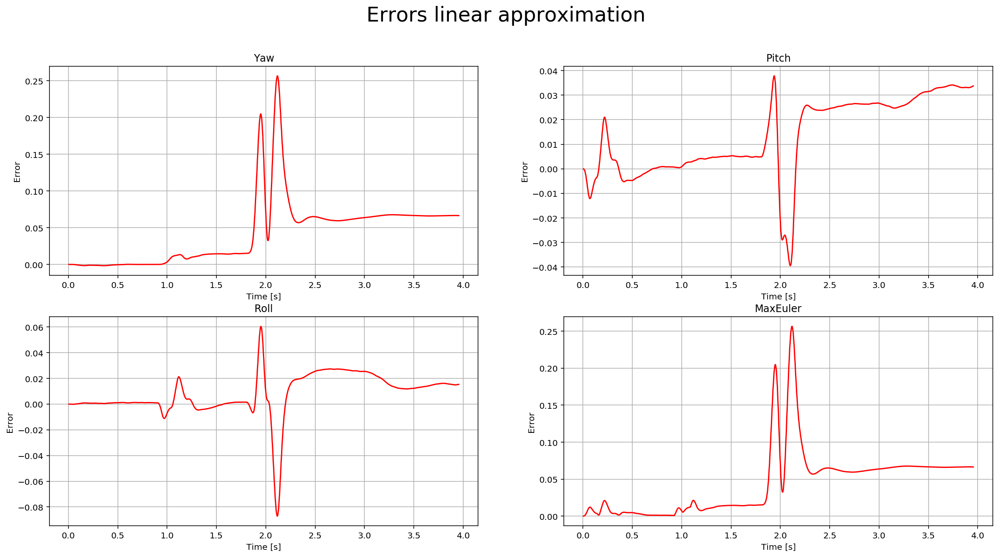
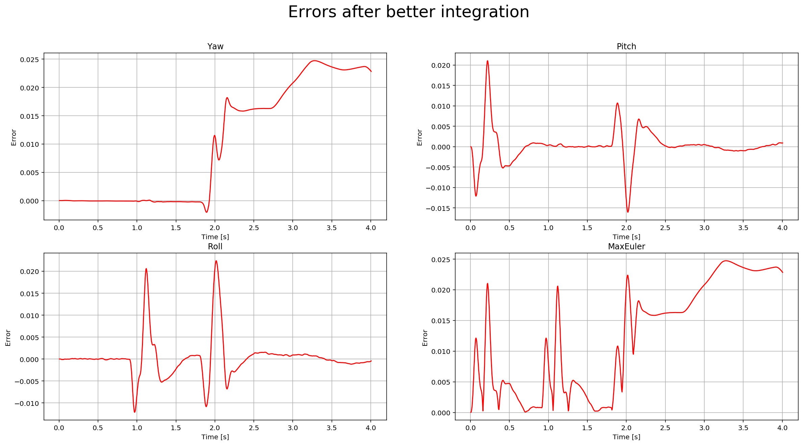

# FCND-Term1-P4-3D-Estimation
Udacity Flying Car Nanodegree - Term 1 - Project 4 - 3D Quadrotor Estimation

This is the last project of the [Flying Car Nanodegree - Term 1 - Aerial Robotics](https://www.udacity.com/course/flying-car-nanodegree--nd787). This project builds on top of the [control project](https://github.com/darienmt/FCND-Term1-P3-3D-Quadrotor-Controller) to get us closer to the reality: noise exists! Using an [Extended Kalman Filter(EKF)](https://en.wikipedia.org/wiki/Extended_Kalman_filter), we need to fusion noisy [GPS](https://en.wikipedia.org/wiki/Global_Positioning_System), [IMU](https://en.wikipedia.org/wiki/Inertial_measurement_unit), and compass(magnetometer) in order to estimate current drone position, velocity and yaw. The EKF is implemented using C++ with the code provided by Udacity on the [seed project](https://github.com/udacity/FCND-Estimation-CPP).


The EKF is a very small part of the code base here. Most of the code provided is the drone simulator. The code is the [/src](,/src) directory, and the following are the files where the main files we need to change:

- [/config/QuadEstimatorEKF.txt](./config/QuadEstimatorEKF.txt): This files contains the parameters for tuning the EKF. As with the control parameters, we don't need to restart the simulator after parameters modifications. This project is not as heavy as the control project on tuning, but it is good to have this feature.
- [/src/QuadEstimatorEKF.cpp](./src/QuadEstimatorEKF.cpp): This is the EKF implementation. There are sections of the code black to be filled by us.
- [/src/QuadControl.cpp](./src/QuadControl.cpp): This is the cascade PID control implemented on last project. There is a great implementation on the seed project, but one of the task is to use your own; so, it last until the last scenario.
- [/config/QuadControlParams.txt](./config/QuadControlParams.txt): It contains our beloved parameters for the control code. Again, there is a set of this parameters on the seed project. They are not spoilers of the last project tuning pleasure because with them you wont pass the tests there.

# Prerequisites

Nothing extra needs to install but the IDE is necessary to compile the code. In my case XCode because I am using a Macbook. Please, follow the instructions on the [seed project README.md](https://github.com/udacity/FCND-Estimation-CPP).

# Run the code

The project consists in six scenarios where most of the missing parts of the EKF needs to be implemented and tested.

## Step 1: Sensor noise

It is step 1 here, but this code contains all the code from the control project as well; so, it is scenario `06_SensorNoise`. The simulator will generate two files with GPS and IMU measurements. The task is to process those files and calculate the standard deviation(sigma) for those sensors.


This video is [scenario1.mov](./videos/scenario1.mov).
When the scenario is passing the test, you should see this line on the standard output:

```
PASS: ABS(Quad.GPS.X-Quad.Pos.X) was less than MeasuredStdDev_GPSPosXY for 67% of the time
PASS: ABS(Quad.IMU.AX-0.000000) was less than MeasuredStdDev_AccelXY for 69% of the time
```

The notebook used to calculate this values is [Step 1 Sensor Noise](./visualizations/Step%201%20Sensor%20Noise.ipynb).

## Step 2: Attitude Estimation

In this step, we need to include information from the IMU to the state. There is a few code provided by us there. The only thing we need to do is to integrate `pqr` from the gyroscope into the estimated pitch and roll. The implementation provided linear. The following figure illustrate the data we get with that implementation:



We need to implement a non-linear one to get better results. First, we need to find the roll, pith and yaw derivates using the following equation from the control lectures:


Once we have the derivates we can multiply them by `dt` to approximate the integral. The following is a more detail graph after the non-linear integration:



And here is a video of the scenario:


This video is [scenario2.mov](./videos/scenario2.mov).
When the scenario is passing the test, you should see this line on the standard output:

```
PASS: ABS(Quad.Est.E.MaxEuler) was less than 0.100000 for at least 3.000000 seconds
```
